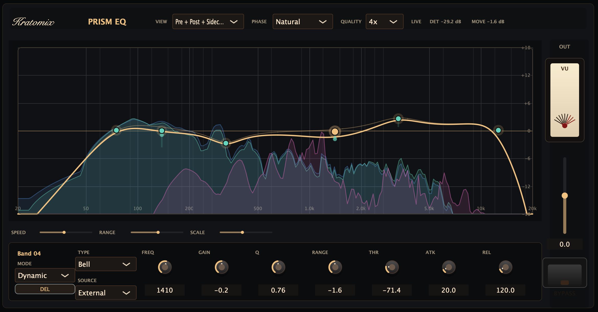
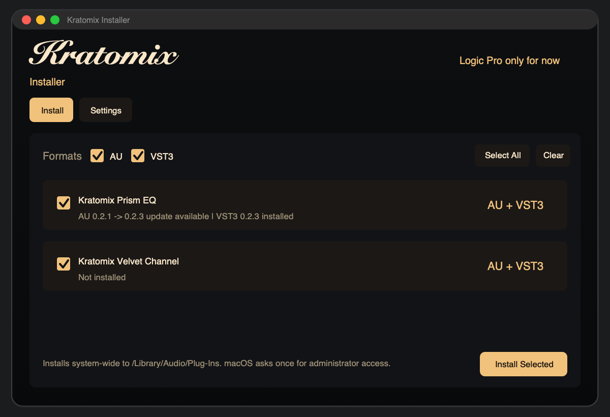

# Kratomix

Kratomix is a JUCE-based plugin monorepo for Logic Pro-first audio effects on macOS. The root repo now carries the shared CMake/Make tooling, plugin metadata contract, and template generator for the full Kratomix line.

## Kratomix Prism EQ



Kratomix Prism EQ is a graph-first dynamic equalizer with live pre/post/sidechain analyzer views, signed dynamic band movement, quality modes, oversampling, and a linear-phase processing path.

## Download & Install

Download the latest release from the [Releases](https://github.com/kratofl/kratomix/releases) page.

Each release ships a Kratomix Installer GUI plus separate plugin ZIP assets.



**Installation:**
1. Download `Kratomix-Installer-<version>-macos.zip` from the release.
2. Unzip it. The archive contains `Kratomix Installer.app` directly.
3. Open `Kratomix Installer.app`.
4. Keep the default manifest URL unless you need a local/offline manifest.
5. Optional: choose the release channel in Settings.
   - `Stable` installs the latest normal release.
   - `Unstable` installs the newest prerelease.
6. Select the plugins and formats you want to install.
7. Choose the install location in Settings: `System-wide` or `User only`.
8. Click `Install Selected`, then restart Logic Pro.

Kratomix targets Logic Pro first. The installer can place AU and VST3 bundles, but Logic Pro uses AU.

System-wide installation writes to:

```text
/Library/Audio/Plug-Ins/Components/
/Library/Audio/Plug-Ins/VST3/
```

User-only installation writes to:

```text
~/Library/Audio/Plug-Ins/Components/
~/Library/Audio/Plug-Ins/VST3/
```

The installer app is unsigned. On first launch, macOS may require right-clicking the app and choosing Open. Updates use the same installer flow. A newer plugin ZIP replaces the previous plugin bundle at the chosen install location.

## Layout

- `core/cmake/`: shared JUCE and plugin registration helpers.
- `plugins/velvet-channel/`: the first production channel-strip plugin.
- `plugins/prism-eq/`: graph-first dynamic EQ foundation.
- `plugins/multiband-compressor/`: graph-led multiband dynamics processor.
- `templates/effect-plugin/`: neutral starter template for future plugins.
- `tools/new-plugin.py`: generator behind `make new-plugin`.
- `mk/*.mk`: root GNU Make command layer.

## Commands

Requirements:

- macOS with Xcode command line tools.
- CMake 3.22 or newer.
- GNU Make.
- JUCE 8, either fetched by CMake or supplied through `JUCE_DIR`.

List registered plugins:

```bash
make list
```

Configure and build everything with the default `Unix Makefiles` generator:

```bash
make build
make test
```

Build, test, run, or validate a single plugin:

```bash
make build PLUGIN=velvet-channel
make test PLUGIN=velvet-channel
make run PLUGIN=velvet-channel
make validate PLUGIN=velvet-channel
```

Create local release assets:

```bash
make package VERSION=1.2.3
make manifest VERSION=1.2.3
make installer VERSION=1.2.3
```

Create and publish a GitHub release:

```bash
make release VERSION=1.2.3
make release VERSION=1.2.3 PLUGIN=prism-eq
make release VERSION=1.2.3 PRERELEASE=1
```

`make release` requires a clean git working tree, creates versioned plugin ZIP files, `manifest.json`, `Kratomix-Installer-<version>-macos.zip`, `INSTALL.md`, and `kratomix-installer-screenshot.png` in `dist/`, creates and pushes the release tag, and publishes the assets with GitHub CLI. Release notes are generated from `dist/RELEASE_NOTES.md` and include the installer screenshot. If `PLUGIN` is omitted, every registered plugin is released.

Use a local JUCE checkout:

```bash
make build JUCE_DIR=/path/to/JUCE
```

Scaffold a new plugin from the shared template:

```bash
make new-plugin SLUG=tape-bloom NAME="Kratomix Tape Bloom" CODE=TBlo
```

## Plugins

- `Kratomix Velvet Channel`: warm source-track strip with stepped EQ color, harmonic drive, hardware-style bypass, and a central VU meter. See [plugins/velvet-channel/README.md](/Users/kratofl/Projects/kratomix/plugins/velvet-channel/README.md).
- `Kratomix Prism EQ`: graph-first dynamic EQ foundation with stable 16-band parameters, neutral processing, and a graph-led editor shell. See [plugins/prism-eq/README.md](/Users/kratofl/Projects/kratomix/plugins/prism-eq/README.md).
- `Kratomix Multiband Compressor`: graph-led six-band dynamics processor with draggable crossovers, sidechain-aware detection, and band-focused controls. See [plugins/multiband-compressor/README.md](/Users/kratofl/Projects/kratomix/plugins/multiband-compressor/README.md).

## License

MIT. See [LICENSE](LICENSE).

## Notes

- `plugins/<slug>/plugin.cmake` is the single source of truth for product name, bundle ID, and AU codes.
- The root Make layer is a command wrapper over CMake and the generator script, not a second build system.
